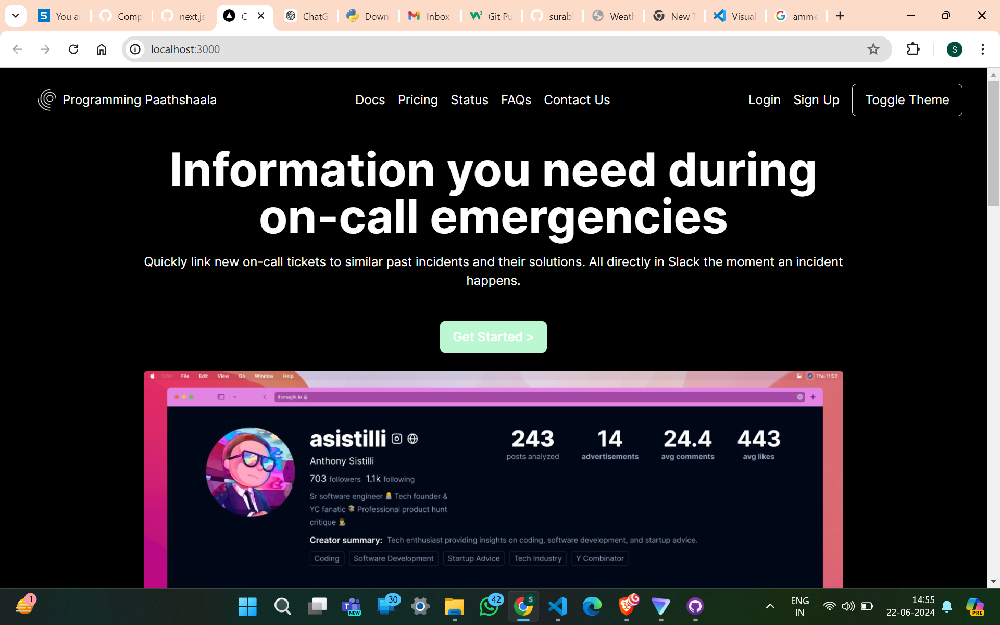
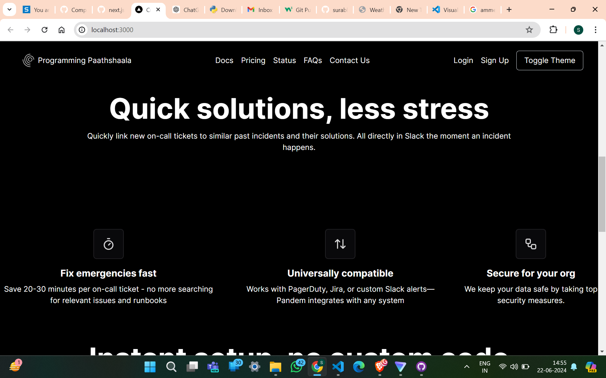
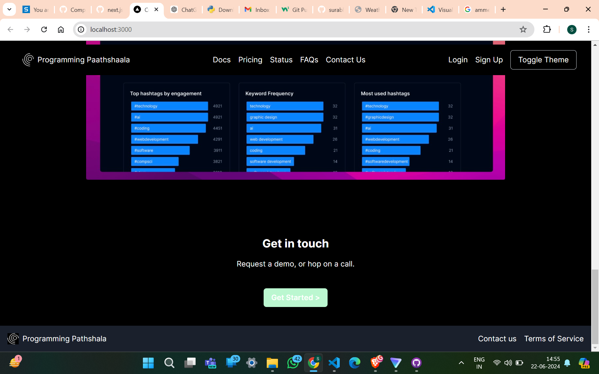
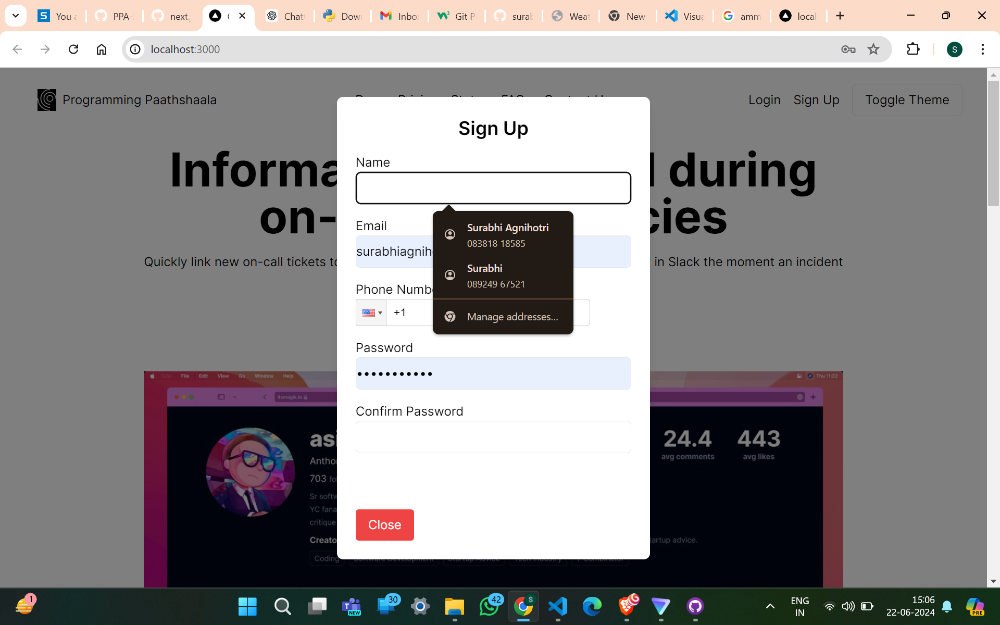

This is a [Next.js](https://nextjs.org/) project bootstrapped with [`create-next-app`](https://github.com/vercel/next.js/tree/canary/packages/create-next-app).


Some Screenshots
<br>

<br>

<br>

<br/>



## Getting Started

First, run the development server:

```bash
npm run dev
# or
yarn dev
# or
pnpm dev
# or
bun dev
```

Open [http://localhost:3000](http://localhost:3000) with your browser to see the result.

You can start editing the page by modifying `app/page.tsx`. The page auto-updates as you edit the file.

This project uses [`next/font`](https://nextjs.org/docs/basic-features/font-optimization) to automatically optimize and load Inter, a custom Google Font.

## Learn More

To learn more about Next.js, take a look at the following resources:

- [Next.js Documentation](https://nextjs.org/docs) - learn about Next.js features and API.
- [Learn Next.js](https://nextjs.org/learn) - an interactive Next.js tutorial.

You can check out [the Next.js GitHub repository](https://github.com/vercel/next.js/) - your feedback and contributions are welcome!

## Deploy on Vercel

The easiest way to deploy your Next.js app is to use the [Vercel Platform](https://vercel.com/new?utm_medium=default-template&filter=next.js&utm_source=create-next-app&utm_campaign=create-next-app-readme) from the creators of Next.js.

Check out our [Next.js deployment documentation](https://nextjs.org/docs/deployment) for more details.


Project Overview
Backend API Development

Developed a Node.js/Express backend API for user sign-up.
Followed clean architecture principles to organize code effectively.
Implemented middleware for handling edge cases and validations.
API Features

Implemented endpoints for user sign-up with validations for all input fields.
Used express-validator for robust validation handling.
Client-Side Integration

Integrated with a React frontend using ShadCN and react-hook-form.
Implemented client-side form validations and error handling.
Added a toggle feature for dark mode using useState in React.
Project Structure

/src
/controllers: Contains API route handlers.
/middlewares: Custom middleware functions.
/routes: Route definitions for API endpoints.
app.js: Entry point for Express application.
Deployment and Testing

Deployed backend on a cloud platform (mention specific platform if applicable).
Tested API endpoints using tools like Postman for functionality and error handling.
Additional Notes

Managed project using Git for version control, with commits reflecting incremental changes.
Ensured compatibility and responsiveness for the frontend design.
Included a .gitignore file to exclude sensitive information from version control.
